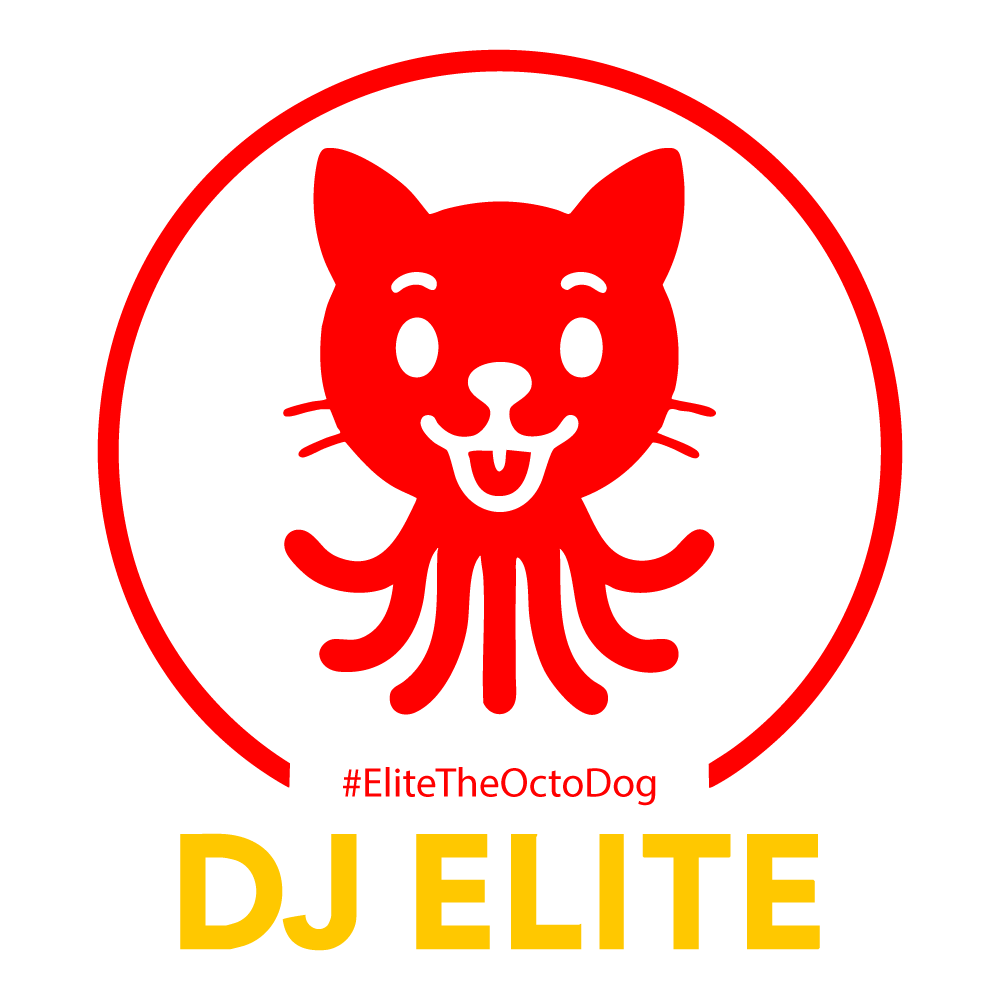

# 🤙🏽 **EliteTheOctoDog™** 🐙🐶

🎯 With over 20 years in data operations, QA, and compliance, I bring a systems mindset rooted in clarity and creativity. I’ve worked across eligibility systems, regulatory workflows, and remote teams. I solve problems by design and instinct. Now building with Python, SQL, and AWS on my own terms.

🧠 Promethean   🎧 Vinyl Manipulator   💻 PC Nerd   🎼 Song Architect

I use GitHub the same way I approach vinyl and music production: hands-on, detail-driven, and built for real use, not theory.

---

### ⚙️ Currently Using + Learning
- **Excel** (leveling up with PivotTables and automation)
- **Python** (focused on problem-solving and automation)
- **SQL** (focused on analysis and reporting)
- **AWS Cloud Foundations** (completed the UH course, CCP exam pending)

---

### 🎯 Focus Areas
- Ensuring data accuracy & validation
- Streamlining workflows and documentation
- Supporting remote teams and peer onboarding
- Merging creativity with real-world tech

---

This space shows how I think and build — creative, structured, and unapologetically real.

<!-- 🎯 Core Stack -->

<!-- ⚙️ AI + Creative Identity -->

---

  

  <strong>🐙🐶 EliteTheOctoDog™ – Where creativity meets systems thinking</strong>

