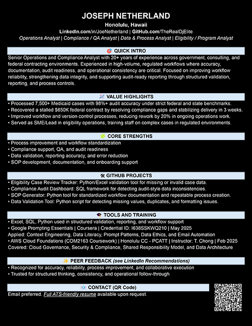

# Operations, QA, and Data Integrity Systems

---

## 📄 Quick Intro

<table>
  <tr>
    <td>
      
      
(click to open PDF)

    </td>
  </tr>
</table>

---

## 🔍 Work Focus

- Analyze high-volume workflows to identify and resolve operational bottlenecks  
- Build validation checks to identify and correct data errors before downstream impact  
- Design reporting frameworks that support audit readiness and operational consistency  
- Create repeatable systems to standardize SOPs and reduce manual rework  

---

## 🛠️ Portfolio Projects

| Project | Problem | My Approach | Result |
|----------|----------|-------------|---------|
| Data Validation Tool | Manual data errors | Python-based automated validation rules | Cleaner data and reduced manual review |
| Compliance Audit Dashboard | Inconsistent reporting | SQL-based validation and reporting logic | Reliable, audit-ready reporting |
| Eligibility Case Review Tracker | Process inconsistencies | Structured data flagging and review workflows | Faster and more consistent case handling |
| SOP Generator | Documentation gaps | Automated Markdown-based SOP generation | Standardized and accessible documentation |

---

## 💻 Tools & Systems

- Excel (structured reporting and validation support)  
- SQL and Python (AI-assisted data validation and workflow support)  
- Office 365 and SharePoint-based operational systems  
- AWS Cloud Foundations coursework (2025)  
- Google Prompting Essentials (2025)  
- Experience across legacy and modern enterprise systems with strong data integrity and troubleshooting focus  

---

## 🌐 Connect

Targeting remote roles in operations, QA, compliance, and data integrity.

 

