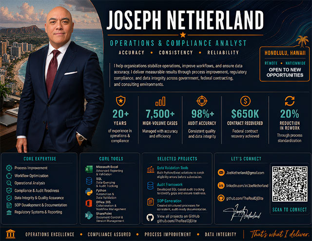

# Operations, Process Improvement & Compliance

<B>JOSEPH NETHERLAND</B> 
Honolulu, HI • Available for Remote Roles (US) 
*Accuracy • Consistency • Reliability* 
Operations • Process Improvement • Compliance • QA • Data Integrity

---

## 👤 Background

Operations and compliance professional with 20+ years of experience across government, federal contracting, and consulting environments. Uses Excel, SQL, and Python in AI-assisted workflows to improve validation, reporting accuracy, and process reliability.

**Highlights:**
- Managed 7,500+ Medicaid cases in IES with 98%+ audit accuracy
- Recovered a stalled $650K federal contract through OSHA/military compliance remediation
- Developed SOPs and validation workflows that reduced rework by 20%

---

## 📄 Quick Intro

A one-page overview of my experience, measurable results, and the operational challenges I've helped organizations solve.

<table>
  <tr>
    <td align="center">
      
       (click to enlarge 11" x 8.5" infographic)
    </td>
  </tr>
</table>

---

## 🔍 What I Build

Built to catch errors before they reach production, keep reporting audit-ready, and reduce manual rework through practical validation, workflow automation, and process standardization.

---

## 🛠️ Projects

These projects demonstrate practical approaches to improving data quality, standardizing workflows, and supporting audit-ready operations.

| Project | Problem | Approach | Result |
|---|---|---|---|
| [Data Validation Tool](https://github.com/TheRealDjElite/DataValidationTool) | Manual data errors | Python-based field-level validation rules | Improved data quality, reduced manual review |
| [Compliance Audit Dashboard](https://github.com/TheRealDjElite/ComplianceAuditDashboard) | Inconsistent reporting | SQL schema + validation queries | Consistent, audit-ready reporting |
| [Eligibility Case Review Tracker](https://github.com/TheRealDjElite/EligibilityCaseReviewTracker) | Process inconsistency | Structured flagging & review workflow | Standardized case review workflow |
| [SOP Generator](https://github.com/TheRealDjElite/SopGenerator) | Documentation gaps | Automated Markdown SOP generation | Consistent process documentation |

---

## 💻 Tools & Systems

- Advanced Excel (AI-assisted validation, reporting, workflow support)
- SQL (AI-assisted validation queries, audit reporting)
- Python (AI-assisted workflow automation and data validation)
- Office 365 and SharePoint
- AWS Cloud Foundations (Coursework)
- Google Prompting Essentials (Certified)

---

## 🌐 Connect

Interested in opportunities involving operations, compliance, QA, data quality, and process improvement in regulated or high-volume environments.

